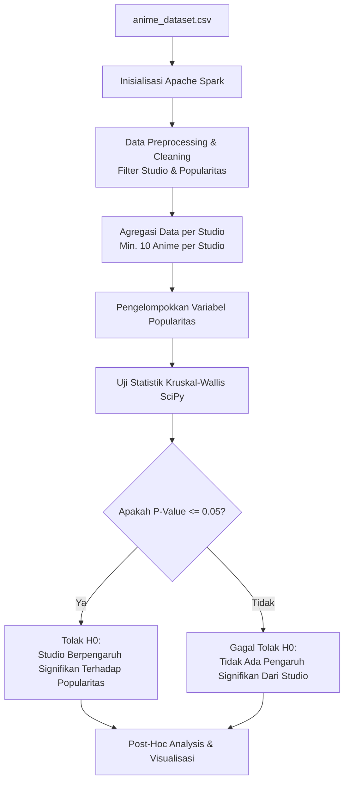

# 🎌 Analisis Pengaruh Studio terhadap Popularitas Anime menggunakan Apache Spark & SciPy (Kruskal-Wallis)

[](https://www.python.org/)
[](https://spark.apache.org/)
[](https://scipy.org/)
[](LICENSE)

Repositori ini berisi dokumentasi dan kode implementasi untuk menganalisis **pengaruh studio produksi terhadap tingkat popularitas anime**. Analisis ini dilakukan menggunakan dataset skala besar `anime-dataset.csv` dengan memanfaatkan kekuatan pemrosesan data terdistribusi dari **Apache Spark (PySpark)** dan pengujian statistik non-parametrik **Kruskal-Wallis** dari **SciPy**.

---

## 📌 Daftar Isi

1. [Penjelasan Analisis](#-penjelasan-analisis)
2. [Manfaat Analisis](#-manfaat-analisis)
3. [Tools yang Diperlukan](#-tools-yang-diperlukan)
4. [Langkah-langkah Melakukan Analisa](#-langkah-langkah-melakukan-analisa)
5. [Struktur Repositori](#-struktur-repositori)
6. [Panduan Kontribusi GitHub](#-panduan-kontribusi-github)
7. [Kontributor & Tim Pengembang ](#-kontributor-tim-pengembang)

---

## 📖 Penjelasan Analisis

Popularitas suatu anime sering kali dikaitkan dengan studio yang memproduksinya (seperti _Ufotable_, _MAPPA_, _Studio Ghibli_, atau _Madhouse_). Namun, apakah reputasi studio secara statistik benar-benar memengaruhi tingkat popularitas anime secara signifikan, ataukah kepopuleran tersebut hanya didorong oleh faktor acak seperti genre atau kampanye pemasaran?

Untuk menjawab pertanyaan ini secara ilmiah, kami melakukan pengujian statistik menggunakan:

1. **Apache Spark (PySpark)**: Digunakan untuk memproses, membersihkan, dan mengagregasi data dari `anime-dataset.csv` secara efisien dan cepat (terutama jika data berukuran besar).
2. **SciPy (Kruskal-Wallis H-Test)**: Karena variabel popularitas biasanya berupa peringkat (_ranking_ atau skala ordinal) dan datanya tidak berdistribusi normal (non-parametrik), pengujian **Kruskal-Wallis** sangat tepat digunakan untuk membandingkan lebih dari dua kelompok independen (yaitu studio-studio anime).

### Alur Analisis Data



---

## 💡 Manfaat Analisis

Analisis ini memberikan berbagai dampak positif dan manfaat bagi berbagai pihak di industri kreatif:

- **Bagi Produser & Investor Anime**: Membantu mengambil keputusan strategis dalam memilih studio animasi mitra berdasarkan bukti data historis keberhasilan popularitas studio tersebut.
- **Bagi Analis Industri & Peneliti**: Memberikan metodologi ilmiah terukur untuk memetakan kekuatan pasar masing-masing studio anime dari waktu ke waktu.
- **Bagi Pengembang & Data Engineer**: Menjadi studi kasus nyata penerapan integrasi Big Data engine (Apache Spark) dengan pustaka komputasi ilmiah (SciPy) dalam satu alur kerja (_pipeline_) hibrida.

---

## 🛠️ Tools yang Diperlukan

Untuk menjalankan analisis ini di mesin lokal Anda, pastikan beberapa perangkat lunak berikut telah terinstal:

### Prerequisites

1. **Java Development Kit (JDK) 8 atau 11** (Wajib untuk menjalankan Apache Spark).
2. **Python 3.8 ke atas**.
3. **Apache Spark (3.x)** yang terkonfigurasi dengan variabel lingkungan (_environment variables_ `SPARK_HOME` dan `HADOOP_HOME` jika di Windows).

### Pustaka Python (Dependencies)

Instal seluruh dependensi Python dengan perintah di bawah ini:

```bash
pip install -r requirements.txt
```

Isi dari `requirements.txt` meliputi:

```text
pyspark>=3.2.0
scipy>=1.7.0
pandas>=1.3.0
matplotlib>=3.4.0
seaborn>=0.11.0
```

---

## 🚀 Langkah-langkah Melakukan Analisa

Berikut adalah panduan langkah demi langkah untuk mereproduksi analisis dari awal hingga akhir:

### Langkah 1: Mempersiapkan Spark Session

Inisialisasi koneksi Spark dengan alokasi memori yang sesuai di dalam script Python Anda.

```python
from pyspark.sql import SparkSession

spark = SparkSession.builder \
    .appName("AnimeStudioPopularityAnalysis") \
    .config("spark.sql.execution.arrow.pyspark.enabled", "true") \
    .getOrCreate()
```

### Langkah 2: Memuat dan Membersihkan Data (Preprocessing)

Baca dataset dan lakukan pembersihan data, seperti menghapus nilai kosong (`null`), studio yang bertuliskan `Unknown`, serta memfilter studio yang memiliki sampel anime terlalu sedikit (misal kurang dari 10 anime) untuk menjaga keandalan uji statistik.

```python
from pyspark.sql.functions import col

# Load data
df = spark.read.csv("anime_dataset.csv", header=True, inferSchema=True)

# Filter data yang tidak valid
df_cleaned = df.filter(
    col("studio").isNotNull() &
    (col("studio") != "Unknown") &
    col("popularity").isNotNull()
)

# Hitung jumlah anime per studio dan saring studio dengan minimal 10 karya
studio_counts = df_cleaned.groupBy("studio").count()
popular_studios = studio_counts.filter(col("count") >= 10)

# Join kembali untuk mendapatkan data akhir yang bersih
df_final = df_cleaned.join(popular_studios, "studio").select("studio", "popularity")
```

### Langkah 3: Ekstraksi Data untuk Uji Statistik

Kelompokkan nilai popularitas berdasarkan studio masing-masing dan kumpulkan ke dalam bentuk list agar dapat diproses oleh SciPy.

```python
# Mengelompokkan data popularitas per studio
grouped_data = df_final.groupBy("studio") \
    .agg({"popularity": "collect_list"}) \
    .collect()

# Ekstraksi list popularitas untuk setiap kelompok studio
studio_groups = [row["collect_list(popularity)"] for row in grouped_data]
```

### Langkah 4: Menjalankan Uji Kruskal-Wallis

Gunakan pustaka `scipy.stats` untuk menguji signifikansi pengaruh studio.

```python
import scipy.stats as stats

# Formulasi Hipotesis:
# H0: Distribusi tingkat popularitas anime sama di semua studio (Tidak ada pengaruh studio).
# H1: Setidaknya satu studio memiliki distribusi popularitas yang berbeda secara signifikan.

stat, p_value = stats.kruskal(*studio_groups)

print("============ HASIL UJI STATISTIK ============")
print(f"Kruskal-Wallis H-Statistic : {stat:.4f}")
print(f"P-Value                    : {p_value:.8e}")

alpha = 0.05
if p_value < alpha:
    print("\nKesimpulan: Tolak H0. Studio berpengaruh SIGNIFIKAN terhadap popularitas anime!")
else:
    print("\nKesimpulan: Gagal Tolak H0. Studio TIDAK berpengaruh signifikan terhadap popularitas anime.")
```

### Langkah 5: Visualisasi Distribusi (Opsional)

Visualisasikan perbandingan distribusi popularitas studio-studio top menggunakan Box Plot untuk mempermudah interpretasi data.

```python
import seaborn as sns
import matplotlib.pyplot as plt

# Konversi sampel data teratas ke Pandas untuk plotting
pd_df = df_final.toPandas()

# Ambil 5 studio dengan jumlah anime terbanyak untuk visualisasi
top_5_studios = pd_df['studio'].value_counts().nlargest(5).index
pd_filtered = pd_df[pd_df['studio'].isin(top_5_studios)]

plt.figure(figsize=(12, 6))
sns.boxplot(data=pd_filtered, x='studio', y='popularity', palette='Set2')
plt.title('Distribusi Popularitas Anime di 5 Studio Terbesar')
plt.xlabel('Studio')
plt.ylabel('Popularitas (Peringkat - Lebih Kecil Lebih Populer)')
plt.gca().invert_yaxis()  # Balik sumbu Y karena ranking 1 adalah yang paling populer
plt.grid(axis='y', linestyle='--', alpha=0.7)
plt.savefig('studio_popularity_distribution.png', dpi=300, bbox_inches='tight')
plt.show()
```

---

## 📁 Struktur Repositori

```text
anime-analisis/
├── anime_dataset.csv      # Dataset anime utama (berisi studio & popularitas)
├── preprocessing.py       # Skrip untuk membersihkan dan memformat data
├── analysis.py            # Skrip utama analisis PySpark & SciPy
├── requirements.txt       # Daftar dependensi pustaka Python
└── README.md              # Dokumentasi proyek (Dokumen ini)
```

---

## 🤝 Panduan Kontribusi GitHub

Kami sangat menyambut baik kontribusi dari komunitas! Baik itu berupa perbaikan bug, penambahan fitur baru, perbaikan dokumentasi, atau saran analisis statistik yang lebih mendalam.

### Panduan Berkontribusi

1. **Fork Repositori**: Klik tombol `Fork` di pojok kanan atas halaman repositori ini.
2. **Clone Lokal**:
   ```bash
   git clone https://github.com/USERNAME/anime-analisis.git
   ```
3. **Buat Branch Baru**: Gunakan penamaan branch yang deskriptif.
   ```bash
   git checkout -b feature/analisis-tambahan-dunn-test
   ```
4. **Lakukan Perubahan & Commit**: Pastikan kode Anda mengikuti standar kebersihan kode (PEP 8 untuk Python).
   ```bash
   git commit -m "Add Dunn post-hoc test analysis in main flow"
   ```
5. **Push ke Fork Anda**:
   ```bash
   git push origin feature/analisis-tambahan-dunn-test
   ```
6. **Buat Pull Request (PR)**: Masuk ke repositori asli dan ajukan Pull Request dari branch Anda.

---

## 👥 Kontributor & Tim Pengembang

Daftar kontributor yang telah mengembangkan proyek analisis ini:

|                                      Foto                                      | Kontributor                                               | Peran                                  | Tugas & Kontribusi                                                                                                                                                                                                                                                                                     |
| :----------------------------------------------------------------------------: | :-------------------------------------------------------- | :------------------------------------- | :----------------------------------------------------------------------------------------------------------------------------------------------------------------------------------------------------------------------------------------------------------------------------------------------------- |
|         | **[Arflifie](https://github.com/Arflifie)**               | **Metodologi & analysis design**       | - Melakukan Metodologi & analysis design menggunakan Apache Spark.<br>- Merancang metodologi pengujian statistik non-parametrik Kruskal-Wallis.<br>- Mengimplementasikan uji statistik akhir menggunakan pustaka `scipy.stats`.<br>- Melakukan interpretasi hasil _p-value_ dan menyimpulkan analisis. |
|  | **[Taufiqurahman13](https://github.com/taufiqurahman13)** | **Dataset collection & preprocessing** | - Melakukan dataset collection & preprocessing.<br>- Membersihkan dataset, menyaring studio _Unknown_, dan memfilter ambang sampel anime minimum.                                                                                                                                                      |

---
